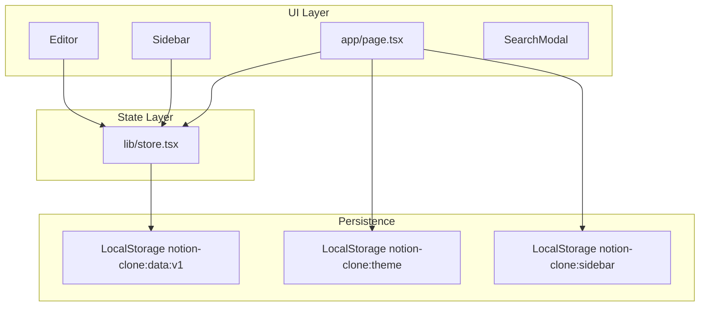
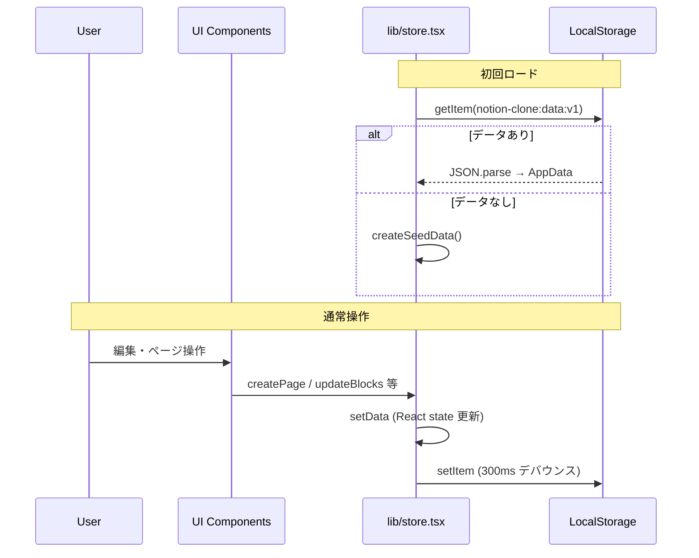

# アーキテクチャ

## システム概要

本アプリは **クライアント専用 SPA** です。サーバーやデータベースは持たず、すべてのデータはブラウザの LocalStorage に保存されます。

Next.js の App Router を使いますが、`output: "export"` によりビルド時に静的 HTML/CSS/JS を `out/` ディレクトリへ出力します。GitHub Pages などの静的ホスティングにそのままデプロイできます。

```1:12:next.config.ts
import type { NextConfig } from "next";

const basePath = process.env.NEXT_PUBLIC_BASE_PATH || "";

const nextConfig: NextConfig = {
  output: "export",
  basePath,
  trailingSlash: true,
  images: {
    unoptimized: true,
  },
};
```

| 設定 | 説明 |
|------|------|
| `output: "export"` | 静的ファイルを `out/` に生成。サーバー機能は使えない |
| `basePath` | サブパス配置用（GitHub Pages では `/<リポジトリ名>`） |
| `trailingSlash: true` | URL 末尾にスラッシュを付与（静的ホスティング向け） |
| `images.unoptimized` | 画像最適化 API を使わない（静的エクスポート必須） |

## レイヤー構成



| レイヤー | 役割 |
|----------|------|
| **UI Layer** | React コンポーネント。ユーザー操作を受け取り Store を更新する |
| **State Layer** | `StoreProvider` / `useStore` による React Context。アプリ全体の単一データソース |
| **Persistence** | LocalStorage への読み書き。アプリデータ・テーマ・サイドバー状態を分離して保存 |

## データフロー



1. **初回ロード**: `StoreProvider` の `useEffect` で LocalStorage から `AppData` を読み込む。データがなければ `lib/seed.ts` のシードデータを使う。
2. **ユーザー操作**: UI コンポーネントが `useStore()` 経由で Store API を呼び出し、React state を更新する。
3. **永続化**: `data` が変わるたびに 300ms デバウンス後、LocalStorage へ JSON として保存する。容量超過などのエラーは黙って無視する。

## ルーティング

Next.js のファイルベースルートは `/` のみです（`app/page.tsx`）。

ページ間の遷移は **URL ハッシュ** で実現します。

```
https://example.com/Notion/#<pageId>
```

- `window.location.hash` を `pageId` として解釈
- `hashchange` イベントでページ切り替え
- サイドバーや検索から `openPage(id)` を呼ぶと `window.location.hash = id` を設定

ハッシュベースのため、静的エクスポートでもページ遷移が可能です。サーバー側のルーティング設定は不要です。

## 状態管理

グローバル状態は `lib/store.tsx` の React Context のみです。Redux や Zustand 等の外部ライブラリは使っていません。

```17:32:lib/store.tsx
const STORAGE_KEY = "notion-clone:data:v1";

interface StoreValue {
  data: AppData;
  loaded: boolean;
  getPage: (id: string) => Page | undefined;
  createPage: (parentId: string | null, partial?: Partial<Page>) => string;
  updatePage: (id: string, patch: Partial<Page>) => void;
  updateBlocks: (pageId: string, updater: (blocks: Block[]) => Block[]) => void;
  deletePage: (id: string) => void;
  restorePage: (id: string) => void;
  destroyPage: (id: string) => void;
  emptyTrash: () => void;
  duplicatePage: (id: string) => string | null;
  toggleFavorite: (id: string) => void;
}
```

`app/page.tsx` でアプリ全体を `StoreProvider` でラップし、子コンポーネントは `useStore()` でアクセスします。

Store API の詳細は [data-model.md](data-model.md) を参照してください。

## テーマ（ダークモード）

テーマはアプリデータとは別の LocalStorage キーで管理します。

| キー | 値 |
|------|-----|
| `notion-clone:theme` | `"dark"` / `"light"` |

**FOUC（フラッシュ）防止**: `app/layout.tsx` のインライン `<script>` が React ハイドレーション前に `document.documentElement.classList` へ `dark` クラスを付与します。`prefers-color-scheme` もフォールバックとして参照します。

**トグル**: `app/page.tsx` の `toggleTheme` がクラス切り替えと LocalStorage 保存を行います。

## サイドバー状態

デスクトップ（幅 640px 以上）では、サイドバーの開閉状態を LocalStorage に保存します。

| キー | 値 |
|------|-----|
| `notion-clone:sidebar` | `"open"` / `"closed"` |

モバイルではドロワー式のため、状態は永続化しません。

## 静的エクスポートの制約

| できないこと | 理由 |
|-------------|------|
| サーバー API Routes | `output: "export"` ではサーバーが存在しない |
| SSR によるデータフェッチ | データはクライアントの LocalStorage のみ |
| `next/image` の最適化 | `unoptimized: true` が必須 |
| 動的ルートのサーバー生成 | すべてクライアント側で処理 |

LocalStorage へのアクセスは必ず `useEffect` 内（クライアントサイド）で行ってください。

## CI/CD

`.github/workflows/deploy.yml` により、`main` ブランチへの push で GitHub Pages へ自動デプロイされます。

```
push to main
  → checkout
  → setup-node (v22)
  → npm ci
  → npm run build (NEXT_PUBLIC_BASE_PATH=/<repo名>)
  → touch out/.nojekyll
  → upload-pages-artifact
  → deploy-pages
```

初回はリポジトリの **Settings → Pages → Source** を **GitHub Actions** に設定する必要があります。
